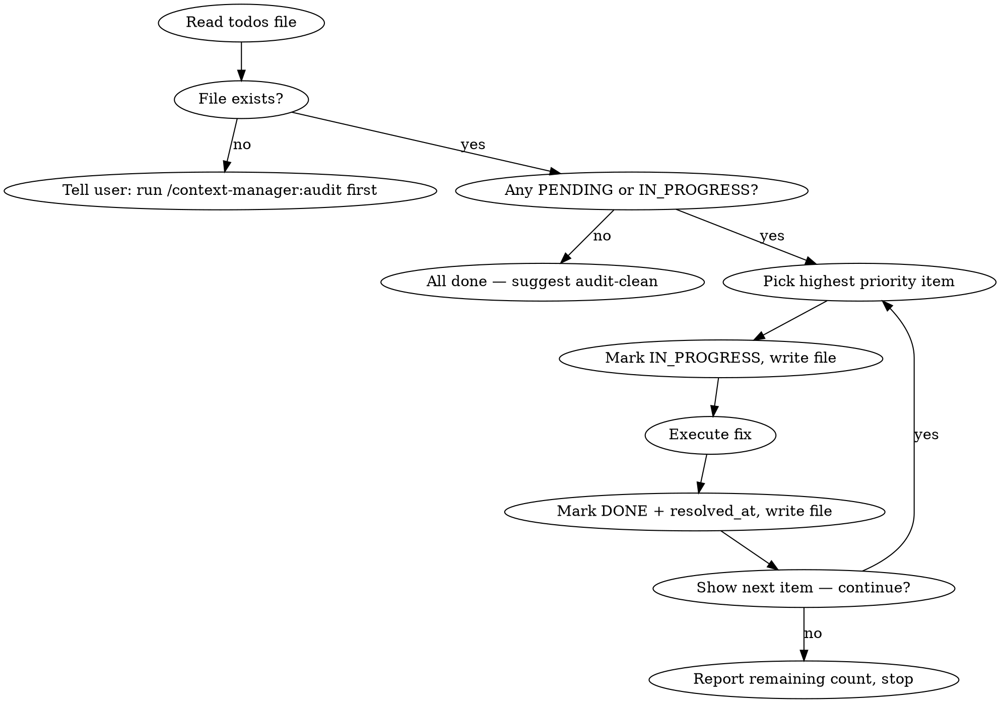

# Context Manager Audit Resolve

## Overview

Reads `.claude/context-manager-todos.json`, picks the highest-priority unfinished item, resolves it, marks it DONE, then offers to continue. Also invoked automatically by `context-manager:audit` when the user agrees to start resolving.

---

## Workflow



---

## Item Selection

Among items with `status: PENDING` or `status: IN_PROGRESS`, pick the one with the lowest `priority` number.

If two items share the same priority number, prefer `IN_PROGRESS` over `PENDING` — always resume interrupted work before starting new items.

---

## Resolving by Category

| Category | Action |
|----------|--------|
| `code_issue` | Read the source file, apply the fix described in `recommendation`, then update the file's entry in its `.folder-context.md` (clear or update WIP/Key logic as appropriate) |
| `stale_context` | Regenerate the `.folder-context.md` for the flagged folder using current file state |
| `missing_context` | Generate a new `.folder-context.md` for the folder following the context-manager format |
| `wip_review` | Read the source file; if the WIP is resolved, remove the WIP field from `.folder-context.md`; if still active, update the WIP description to reflect current state |

---

## State Updates

Write the file **before** starting the fix (mark `IN_PROGRESS`) and again **immediately after** the fix (mark `DONE`). Never hold state in memory only — if context clears mid-resolve, the next run can see IN_PROGRESS and resume.

```json
{ "status": "IN_PROGRESS" }
```
→ fix applied →
```json
{ "status": "DONE", "resolved_at": "<ISO timestamp>" }
```

---

## Stopping

When the user declines to continue, confirm: "**N** items remain. Run `/context-manager:audit-resolve` to continue, or `/context-manager:audit-clean` to remove completed items."

---

## Common Mistakes

| Mistake | Fix |
|---------|-----|
| Starting the next item before writing DONE for the current one | Write file after every state change |
| Skipping IN_PROGRESS items | Always resume IN_PROGRESS before starting PENDING |
| Fixing a code_issue without updating .folder-context.md | Always update context after a source file edit |
