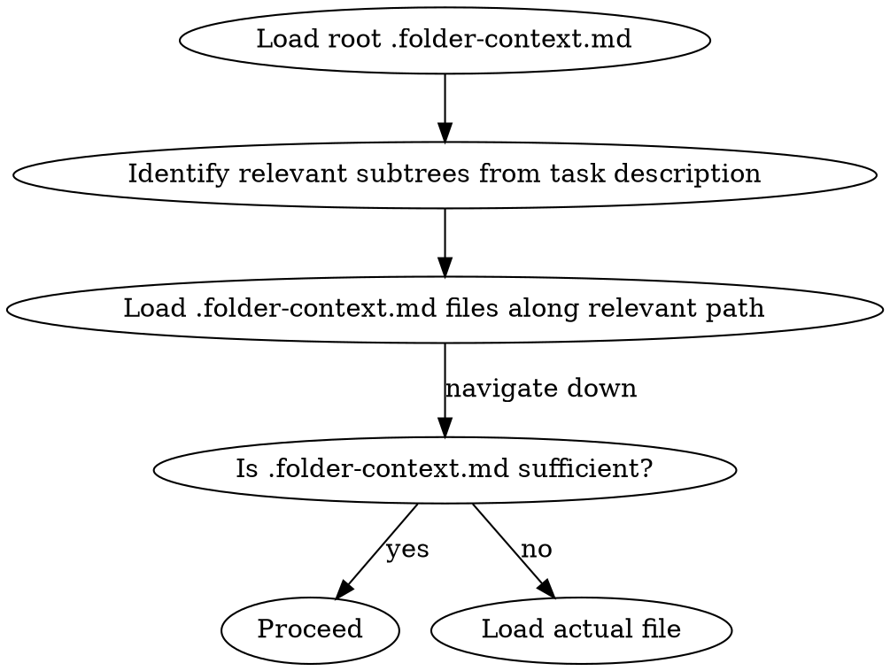

# Context Manager

## Overview

Maintains a `.folder-context.md` in every folder that contains relevant files, capturing source file purposes, exports, key logic, and WIP state. Enables hierarchical navigation of large codebases without loading full files, and survives context clears by providing a reliable starting point.

**Core principle:** Claude reads .folder-context.md files top-down to locate relevant code, rather than loading the full codebase. Claude writes .folder-context.md files after every source file edit, keeping them current.

---

## File Classification

Before generating or updating any .folder-context.md, classify each file:

### Ignore entirely (never appear in .folder-context.md)
- All gitignored files and folders (run `git check-ignore` to test)
- The `.claude/` directory and all its contents
- `.folder-context.md` files themselves
- Common generated/vendor directories (always excluded regardless of gitignore):
  `node_modules/`, `.git/`, `__pycache__/`, `dist/`, `build/`, `out/`, `.venv/`, `venv/`, `.next/`, `.nuxt/`, `coverage/`, `.turbo/`, `target/`, `vendor/`, `bin/`, `obj/`

### List only (appear in .folder-context.md as a bare filename, no detail)
Non-gitignored files that are not source code:
- Markup/template: `.html`, `.htm`, `.xml`, `.svg`, `.vue` (template-only), `.hbs`, `.ejs`
- Styles: `.css`, `.scss`, `.sass`, `.less`
- Config/data: `.json`, `.yaml`, `.yml`, `.toml`, `.ini`, `.env`, `.env.*`, `.lock`
- Documentation: `.md`, `.txt`, `.rst`, `.pdf`
- Build/tooling: `Dockerfile`, `.dockerignore`, `.gitignore`, `Makefile`, `*.config.js`, `*.config.ts`
- Assets: images, fonts, audio, video

### Full detail (Role, Exports, Key logic, WIP)
Source code files — anything humans write logic in:
- `.ts`, `.tsx`, `.js`, `.jsx`, `.mjs`, `.cjs`
- `.py`, `.pyw`
- `.go`
- `.rs`
- `.java`, `.kt`, `.scala`
- `.cs`, `.fs`, `.vb`
- `.cpp`, `.c`, `.h`, `.hpp`
- `.rb`, `.php`, `.swift`
- `.sh`, `.bash`, `.zsh`, `.ps1`
- `.sql`
- `.r`, `.jl`, `.lua`, `.ex`, `.exs`, `.clj`

When in doubt: if the file contains logic that can be reasoned about, give it full detail.

---

## Initialization (First Run)

Check for `.claude/context-manager.json`. **If it exists, skip to [Staleness Check](#staleness-check)** — the skill is already running; re-invoking is a no-op.

If `.claude/context-manager.json` does not exist:

### 1. Update .gitignore
Ensure `.folder-context.md` files are never committed to the repository:

- If a `.gitignore` exists in the project root, check whether it already contains a `.folder-context.md` entry. If not, append:
  ```
  # context-manager skill
  .folder-context.md
  ```
- If no `.gitignore` exists, create one with that entry.
- Use the exact pattern `.folder-context.md` (no leading slash, no glob prefix) — git matches this at any depth in the tree.

### 2. Set Up Hook
Use the `update-config` skill to add to project `.claude/settings.json`:

```json
{
  "hooks": {
    "PostToolUse": [
      {
        "matcher": "Write|Edit|NotebookEdit",
        "hooks": [
          {
            "type": "command",
            "command": "python3 .claude/scripts/mark-context-dirty.py"
          }
        ]
      }
    ]
  }
}
```

Then copy `mark-context-dirty.py` from the skill directory into `.claude/scripts/mark-context-dirty.py`. Create `.claude/scripts/` if it does not exist.

### 3. Generate All .folder-context.md Files
Walk the entire project tree. For every folder that contains at least one non-ignored, non-.folder-context.md file:
1. Classify each file using [File Classification](#file-classification)
2. Write `.folder-context.md` using the [format below](#contextmd-format)
3. Only track source code files in frontmatter timestamps (list-only files are not tracked)

### 4. Mark as Initialized
Write `.claude/context-manager.json`:
```json
{
  "initialized": true,
  "initialized_at": "<ISO timestamp>",
  "version": 1
}
```

---

## Core Behavior: After Every File Edit

**After every Write, Edit, or NotebookEdit tool call**, immediately:

1. **Classify the file**: if it is gitignored or in `.claude/`, do nothing. If the file is `.gitignore`, run the gitignore protection check (see below) before any other step.
2. **Update same folder**: regenerate the file's entry in its folder's `.folder-context.md` (full detail if source code, list-only entry if non-source). Update `context_updated` to now, and for source files set `last_modified` to the file's **actual mtime from the filesystem** — run `stat` (or equivalent) on the file and use that value exactly. Never guess, round, or use the current time as a substitute.
3. **Cascade up**: for each parent folder up to the project root, update the subfolder description in that parent's `.folder-context.md` if it changed. Stop cascading if unchanged.
4. **Drain dirty list**: read `.claude/pending-context-updates.txt`. For any file not already handled in this cycle, update its folder's .folder-context.md. Clear the file after processing.

### .gitignore Protection

Whenever `.gitignore` is written or created (by Claude or detected via the dirty list), immediately verify that `.folder-context.md` is present as a pattern. If it is missing, append it. This prevents a scenario where someone overwrites or creates a `.gitignore` that removes the entry.

The hook script (`mark-context-dirty.py`) handles this automatically for any `.gitignore` write detected via the PostToolUse hook.

---

## Staleness Check

Only source code files are tracked in frontmatter timestamps. For each `.folder-context.md`, compare each tracked file's `last_modified` to its actual mtime on disk (via `stat`). If any file is newer, the .folder-context.md is stale.

When resolving staleness, use judgment:
- If the file content has changed since the description was written — regenerate the full entry.
- If the description is still accurate and only the timestamp is behind — update `last_modified` to the actual mtime without rewriting the entry.

Run the staleness check:
- On skill invocation
- When processing `.claude/pending-context-updates.txt`
- At the start of a new session (if `.claude/context-manager.json` exists)

---

## .folder-context.md Format

```markdown
---
context_updated: 2026-04-29T10:00:00Z
tracked_files:
  - file: foo.ts
    last_modified: 2026-04-29T09:55:00Z
  - file: bar.py
    last_modified: 2026-04-29T09:50:00Z
---

# [Folder Name]

## Purpose
[What this folder/module is responsible for. One short paragraph.]

## Source Files

### `foo.ts`
- **Role**: [What this file does]
- **Exports**: `FooClass`, `fooHelper()`, `FOO_CONSTANT`
- **Key logic**: [1-2 sentences on non-obvious behavior, algorithms, or constraints]
- **WIP**: [In-progress state or known issues — omit if stable]

### `bar.py`
- **Role**: ...
- **Exports**: ...

## Other Files
`package.json`, `tsconfig.json`, `.env.example`, `README.md`

## Subfolders
- `./utils/` — [One-line description]
- `./components/` — [One-line description]
```

`WIP` only when there is active in-progress state or known breakage. `Key logic` only for genuinely non-obvious behavior. `Other Files` is a flat comma-separated list — no descriptions.

---

## Loading Context After /clear or New Session



Never load all .folder-context.md files at once. Start at root, navigate down to relevant branches only. Load actual file contents only when .folder-context.md is insufficient.

---

## Cascade Rules

When `a/b/c/foo.ts` changes:

| Level | What to update |
|-------|----------------|
| `a/b/c/.folder-context.md` | Full update: source file entry, frontmatter timestamps |
| `a/b/.folder-context.md` | Subfolder `c/` description only (if changed) |
| `a/.folder-context.md` | Subfolder `b/` description only (if changed) |
| `.folder-context.md` (root) | Subfolder `a/` description only (if changed) |

Stop cascading at any level where the subfolder description is unchanged.

---

## Companion Commands

Nine commands extend the skill for navigation, annotation, health checks, and structured issue resolution:

| Command | Purpose |
|---------|---------|
| `/context-manager:status` | Quick health snapshot — coverage, staleness, WIP count, annotations, and open todos. Read-only. |
| `/context-manager:wip` | Surface all active WIP entries across the project in one list. Resolve or act on them from there. |
| `/context-manager:search` | Search across all `.folder-context.md` files and annotations for a keyword, symbol, or concept. |
| `/context-manager:brief` | Synthesise the context tree into a readable prose overview — architecture, WIP, open issues, and annotations. |
| `/context-manager:annotate` | Add, edit, remove, or list persistent human notes on files and folders. Notes survive regeneration. |
| `/context-manager:repair` | Regenerate only stale or missing context files. Also flags orphaned annotations. Lightweight alternative to a full audit. |
| `/context-manager:audit` | Full two-pass scan: metadata sweep for stale/missing/WIP issues, then targeted source reads for code issues. Writes a prioritized todo list to `.claude/context-manager-todos.json`. |
| `/context-manager:audit-resolve` | Work through the todo list one item at a time, highest priority first. Resumes across sessions via IN_PROGRESS state. |
| `/context-manager:audit-clean` | Remove all DONE items from the todo list. |

**Persistent files** (all in `.claude/`, never committed):
- `.claude/context-manager.json` — init state
- `.claude/context-manager-todos.json` — prioritized issue list from audit
- `.claude/context-annotations.json` — human and Claude-authored notes on files and folders

**Annotations** surface across all skills: search includes annotation text, brief includes them under module descriptions, audit notes them alongside findings, repair flags orphans when annotated paths are deleted.

**Typical workflows:**
- Daily: `status` → `wip`
- Periodic deep pass: `audit` → `audit-resolve` → `audit-clean`
- Navigation: `search`
- Onboarding / session start: `brief`
- Institutional knowledge: `annotate`
- After many edits without Claude: `repair`

---

## Common Mistakes

| Mistake | Fix |
|---------|-----|
| Documenting gitignored or `.claude/` files | Always classify before writing .folder-context.md |
| Giving full detail to config/asset files | List-only for non-source files |
| Tracking list-only files in frontmatter timestamps | Only source code files go in `tracked_files` |
| Only updating the changed file's folder | Always cascade to parents |
| Re-running setup on subsequent invocations | Check `.claude/context-manager.json` first |
| Loading all .folder-context.md files at session start | Root first, navigate down by relevance |
| Updating .folder-context.md for .folder-context.md edits | Skip paths ending in `.folder-context.md` |
| Guessing or rounding `last_modified` timestamps | Always run `stat` on the file and use the exact mtime — never approximate |
