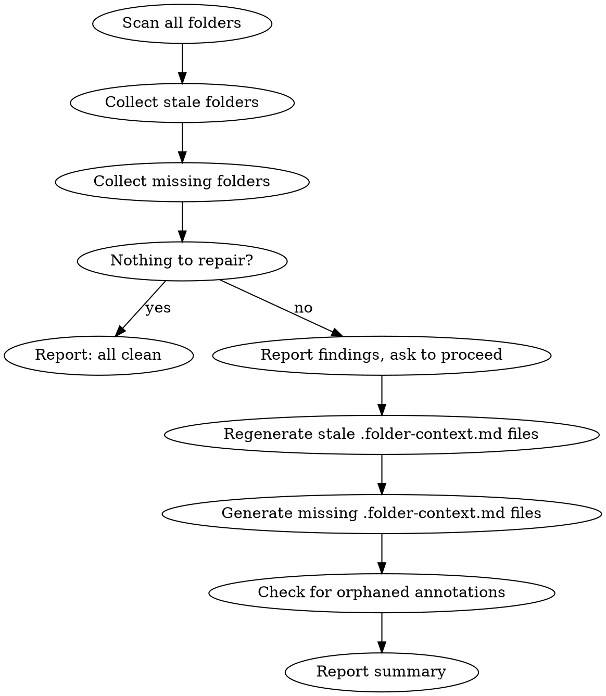

# Context Manager Repair

## Overview

Finds and regenerates stale and missing `.folder-context.md` files, then checks for orphaned annotations. Does not read source files beyond what is needed for regeneration. No todo list, no code review — just keeping context current.

The typical flow: run `/context-manager:status`, see that N folders are stale or missing, run `/context-manager:repair` to fix them.

---

## Prerequisites

Check `.claude/context-manager.json` exists. If not, tell the user to run `context-manager:context-manager` first.

---

## Workflow



---

## Phase 1: Scan

Walk the project tree (same ignore rules as context-manager). For each folder:

**Stale:** Any entry in `tracked_files` has a `last_modified` older than the file's actual mtime on disk. Record the folder path and which files drifted.

**Missing:** Folder contains at least one source file but has no `.folder-context.md`. Record the folder path.

If nothing is stale or missing, say: "Everything is current — no repairs needed." Stop.

---

## Phase 2: Report and Confirm

Before repairing, show what was found:

```
Repair needed — 4 items

Stale (3):
  src/auth/         — session.py modified 2 days ago
  src/api/routes/   — users.ts modified 6 hours ago
  tests/unit/       — auth.test.ts modified 1 day ago

Missing (1):
  src/utils/        — 3 source files, no context file
```

Ask: **"Repair these now?"**
- **Yes** → proceed
- **No** → stop; remind user they can run `/context-manager:repair` anytime

---

## Phase 3: Repair

For each stale folder: read the source files that drifted, regenerate their entries in the `.folder-context.md`, update `context_updated` and `last_modified` in frontmatter. Cascade to parent folders if subfolder descriptions changed.

For each missing folder: generate a new `.folder-context.md` from scratch following the context-manager format.

Apply the same file classification rules as the core skill (source files get full detail, list-only files get bare name).

---

## Phase 4: Orphan Check

After repairs, read `.claude/context-annotations.json` if it exists. For each annotation, check whether its `path` still exists on disk.

If orphans found:
```
Orphaned annotations — 1 found

  src/old-auth/     — folder no longer exists
```

Ask: "Remove this annotation, update its path, or leave it for now?" Handle each orphan per the user's answer.

If no annotation file exists, or no orphans, skip silently.

---

## Report Summary

```
Repair complete

Regenerated:  3 stale folders
Created:      1 missing context file
Orphans:      1 annotation flagged (src/old-auth/)
```

---

## Common Mistakes

| Mistake | Fix |
|---------|-----|
| Reading all source files upfront | Only read source files for folders that are actually stale or missing |
| Running code review or writing todos | Repair is context-only — no audit logic |
| Auto-deleting orphaned annotations | Flag and ask; never delete without user instruction |
| Skipping the confirm step | Always show what will be repaired before doing it |
| Cascading to unchanged parent descriptions | Stop cascade at any level where the subfolder description is unchanged |
